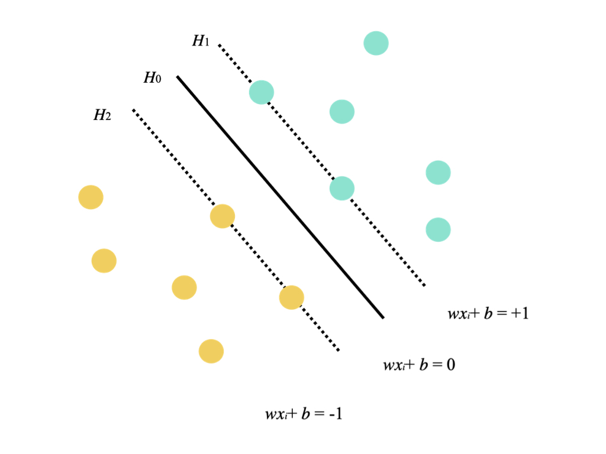
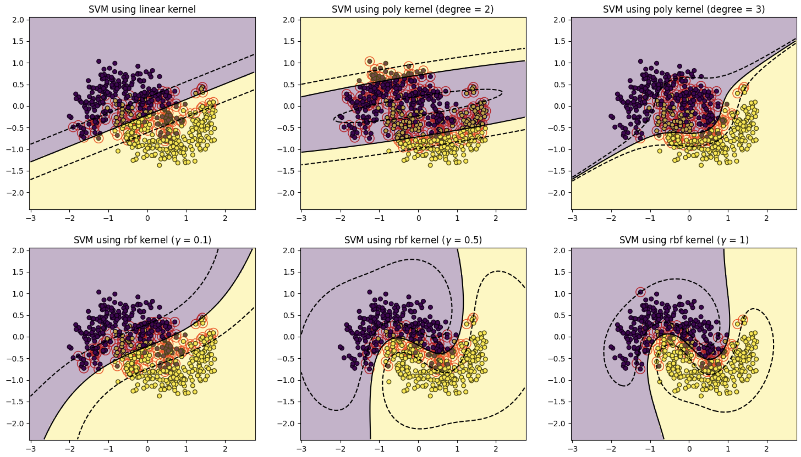
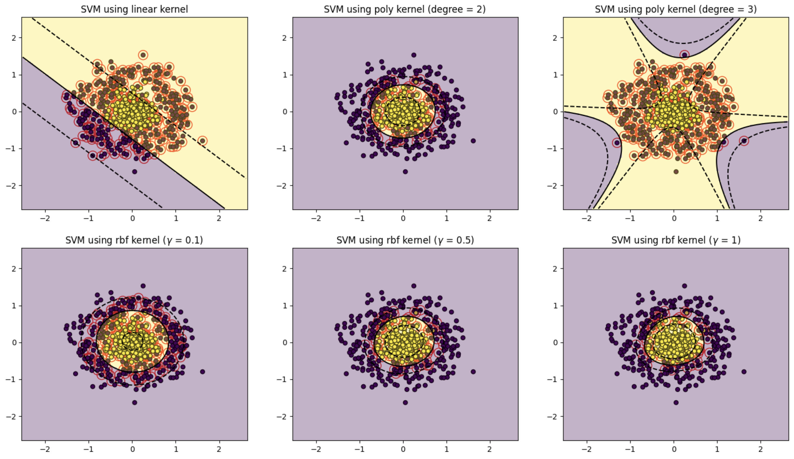

# The Beauty of Radial Basis Functions in SVMs

In this repository, we explore the use of Radial Basis Functions (RBFs) in Support Vector Machines (SVM), which are essentially hyperplanes that aim to linearly separate data points. For example, in a case where there are two classes of data points, the SVM aims to find the hyperplane that maximises the minimum distance between the hyperplane (i.e. decision boundary) and the two separate classes of data points. In this case, we define the hyperplanes $H$ such that:

```math

wx_i+b \geq + 1 \quad when \quad y_i = +1

```

```math

wx_i+b \leq - 1 \quad when \quad y_i = -1

```

and $H_1$ and $H_2$ are the hyperplanes:

```math

H_1: wx_i + b = +1

```

```math

H_2: wx_i + b = -1

```

then the points on hyperplanes $H_1$ and $H_2$ are the tips of the support vectors (Note: Support vectors are the data points that lie closest to the decision boundary and fully specify it.)

We can then define another plane $H_0$ which is equidistant from $H_1$ and $H_2$, that will form the decision surface separating the two classes:

```math

wx_i+b = 0

```

The above structures can be illustrated as the following:

<p align="center">

</p>

The real beauty and power of SVMs lie in its ability to incorporate a "kernel" to transform data onto a higher dimensional space, where it then finds the hyperplane that best distinguishes the data points. With the right kernel, this allows SVMs to find decision boundaries which are *non-linear*.

## Radial Basis Functions

Radial Basis Function (RBF) kernels are one of the most generalised forms of kernelisation and is widely used because of its useful properties:

1. **Non-Linearity**: The RBF kernel implicitly maps the data into an infinite-dimensional space where complex, non-linear decision boundaries become possible.

2. **Localized Influence**: The exponential decay means that the RBF kernel gives higher weight to points that are close together and nearly ignores points that are far apart. This makes it particularly good at capturing local patterns in the data, which is key for non-linear problems where class boundaries depend on proximity.

3. **Flexibility with Gamma**: The $\gamma$ parameter controls how "tight" or "loose" the decision boundary is:

- Small $\gamma$ (large $\sigma$): Wider influence, smoother boundaries, more generalisation.
- Large $\gamma$ (small $\sigma$): Narrow influence, tighter boundaries, more sensitivity to individual points (can lead to overfitting). This tunability lets you adapt the model to different datasets.

4. **No Need for Feature Engineering**: Unlike polynomial kernels (which require choosing a degree), RBF does not assume a specific form for the non-linearity. It can adapt to a wide variety of patterns without requiring you to manually define the transformation.

Mathemtically, the RBF kernel is defined as:
```math

K(x,x') = \exp (-\frac{||x-x'||^2}{2\sigma^2})

```
where $x$ and $x'$ are two data pooints, $||x-x'||$ is the squared Euclidean distance betewen them, and $\sigma$ is the parameter controlling $\gamma$ through the form $\gamma = \frac{1}{2\sigma^2}$.

## RBF SVMs at Work
In this example, we show how SVMs with different kernels (e.g. linear, polynomial, RBF) and parameters fare in separating linearly-inseparable data points, and evaluate their classification performance in the form of confusion matrices.

For illustration, the decision boundaries plotted for each of these cases are shown below:

<p align="center">

</p>

<p align="center">

</p>